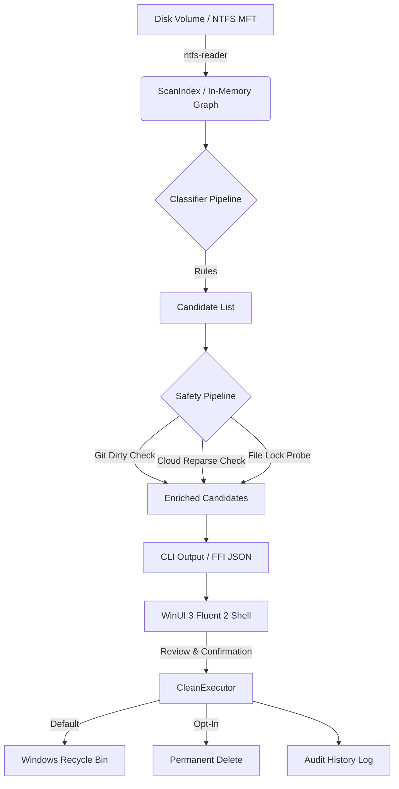

# CONTEXT.md — Domain Model & System Architecture

> Formal domain definitions, architectural seams, and deep module design for Undrift.

## 1. Domain Glossary

| Term | Definition |
|---|---|
| **`FileRecord`** | A lightweight in-memory representation of an individual file or directory record obtained from the NTFS Master File Table (or filesystem directory walk). Contains record ID, parent ID, size, timestamps, and raw Windows attribute flags. |
| **`ScanIndex`** | The complete in-memory indexed graph of the scanned volume. Maintains `parent_id -> children` mappings and a name lookup index to allow $O(1)$ child checks without disk I/O. |
| **`Subtree Stats`** | Aggregate metrics (total bytes, file count, latest modification date) computed entirely in RAM by traversing the `ScanIndex` tree hierarchy in microseconds. |
| **`ArtifactCategory`** | The developer workflow taxonomy (e.g. `NodeModules`, `RustTarget`, `PythonVenv`, `VisualStudio`, `GradleCache`, `StaleInstaller`, `WindowsUpdate`). |
| **`ClassificationRule`** | A stateless evaluation trait that inspects a `FileRecord` in the context of its parent directory in `ScanIndex` to decide if it constitutes reclaimable build output. |
| **`ReclaimCandidate`** | A concrete reclamation target presented to the user, enriched with exact size, file count, human reason, and safety validation flags. |
| **`GitRepoStatus`** | Safety descriptor indicating whether the enclosing Git repository is clean, dirty (uncommitted modifications), or absent. |
| **`CleanExecutor`** | The deletion engine. Employs the system Recycle Bin (`trash`) by default; permanent deletion is an explicit opt-in. |
| **`HistoryManager`** | Plain-text audit log (`history.jsonl`) recording the timestamp, byte count, and paths of every executed reclamation. |

## 2. Architectural Seams & Deep Modules



### Seam 1: Volume Scanner (`core/src/scanner/`)
- **Interface**: `VolumeScanner::scan(path) -> Result<ScanIndex, ScanError>`
- **Hiding**: Hides whether records are read via raw NTFS cluster runs (`ntfs-reader`) or via recursive traversal (`walkdir`). Upstream classifiers operate solely on `ScanIndex`.

### Seam 2: Classification Pipeline (`core/src/classifier/`)
- **Interface**: `ClassifierPipeline::classify(&ScanIndex) -> Vec<ReclaimCandidate>`
- **Hiding**: Hides rule evaluation order, ancestor suppression (skipping sub-dependencies of an already matched folder), and in-memory subtree size summation.

### Seam 3: Safety Pipeline (`core/src/safety/`)
- **Interface**: `SafetyPipeline::evaluate_candidates(&mut [ReclaimCandidate])`
- **Hiding**: Hides `git2` discovery, status mask evaluation, Windows `FILE_ATTRIBUTE_RECALL_ON_DATA_ACCESS` bit checking, and file lock probes.

### Seam 4: Interop Seam (`core/src/ffi.rs` & `app/CoreInterop/`)
- **Interface**: JSON-over-stdio CLI (`undrift scan --json`) and C-ABI P/Invoke exports (`undrift_scan_path`, `undrift_clean_json`).
- **Hiding**: Completely decouples the C# WinUI 3 process from Rust internal memory structures.

## 3. Performance Architecture & Benchmarks

To maintain WizTree-class scanning and classification performance on real monorepos and multi-terabyte drives, the engine enforces five performance invariants:

1. **Zero Path Hashing during Ingestion**:
   - `NtfsMftScanner` ingests raw NTFS records directly by their native 64-bit file reference number (`file.number()`) and parent directory reference (`name.parent()`).
   - String path construction (`PathBuf`) is entirely bypassed during volume scanning. Paths are only resolved lazily for surfaced candidates via `ScanIndex::resolve_path(record_id)`.

2. **$O(\text{Tree Depth})$ Candidate Ancestor Suppression**:
   - `ClassifierPipeline` suppresses nested sub-dependencies (e.g. `node_modules` inside another package's `node_modules`) without string prefix scans.
   - It maintains a `HashSet<u64>` of matched candidate IDs and climbs the `parent_id` chain up the in-memory tree hierarchy. This avoids quadratic string checks ($O(N \times M)$) and runs in microseconds ($O(N \times \text{depth})$).

3. **Thread-Safe Per-Repository Git Status Caching**:
   - `GitSafetyChecker` caches discovered repository roots and uncommitted status entries in an `RwLock<HashMap<PathBuf, ...>>`.
   - In monorepos containing dozens or hundreds of build artifacts, `repo.statuses()` runs exactly once per repository root. Subsequent candidate evaluations within that repo filter dirty paths in-memory without invoking git2 or touching disk.

4. **Rayon Multi-Core Safety Pipeline**:
   - Candidate safety evaluation is parallelized across available CPU threads using `rayon::par_iter_mut()`.
   - Thread-safe caches allow simultaneous evaluation of candidate locks, reparse points, and git status without mutex contention.

5. **Windows Restart Manager API**:
   - On Windows, `InUseChecker` queries the native Restart Manager (`RmStartSession`, `RmRegisterResources`, `RmGetList`, `RmEndSession`) to authoritatively detect processes holding active handles inside a candidate directory.
   - Cross-platform builds fall back gracefully to non-blocking file probe heuristics.

### Running the Performance Benchmark

Run the automated synthetic benchmark harness:
```bash
cargo bench
```
The harness generates a multi-package monorepo fixture (Node, Rust, Python, and Downloads), benchmarks ingestion throughput, classification latency, and parallel safety pipeline time, printing a structured timing report.

